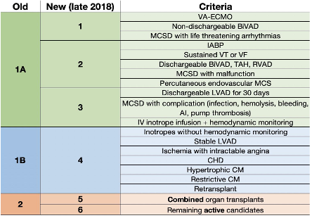
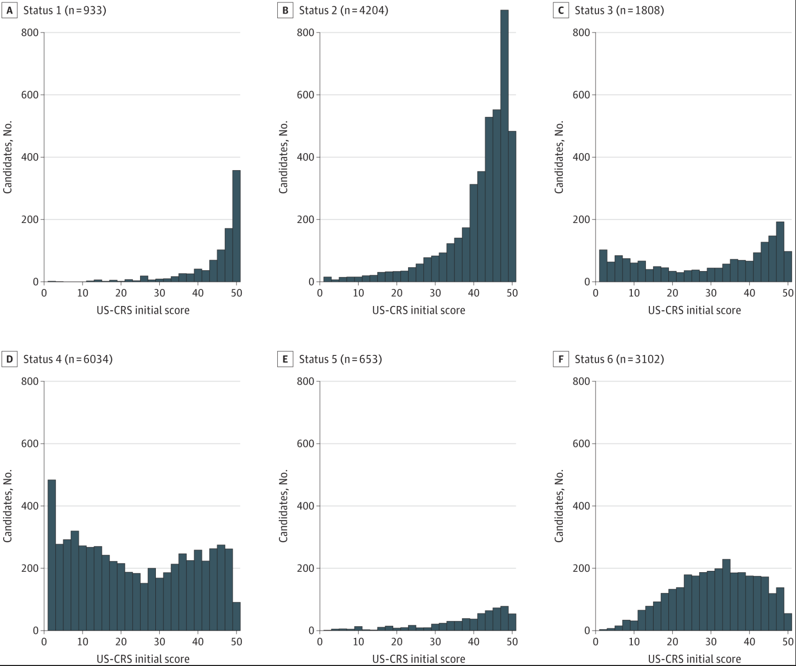

# US-CRS Match Run Analysis

Counterfactual analysis of US heart allocation comparing the current therapy-based 6-status system with a proposed continuous [US-CRS (Candidate Risk Score)](https://jamanetwork.com/journals/jama/fullarticle/2814884) allocation policy.

## Overview

This project simulates heart allocation match runs to evaluate how outcomes would change under a US-CRS-based allocation system. The analysis uses 2024 SRTR heart match run data to compare allocation efficiency and candidate prioritization between current and proposed policies.

## US-CRS Status Mapping

The current US heart allocation system uses therapy defined status levels to allocate donor hearts. 



There is wide heterogenity of patient risk within each status. The [US-CRS score](https://jamanetwork.com/journals/jama/fullarticle/2814884) is a multivariable urgency score for risk of death without a transplant that is based on candidate labs and mechanical circulatory support type. 



The proposed allocation replaces the adult therapy-based statuses with categories of risk based on US-CRS scores:

| Status | US-CRS Range | Description |
|--------|-------------|-------------|
| Status 1 | ≥49 | Highest priority |
| Status 2 | 40-48 | High priority |
| Status 3 | 30-38 | Moderate-high priority |
| Status 4 | 20-28 | Moderate priority |
| Status 5 | 10-18 | Lower priority |
| Status 6 | 0-9 | Lowest priority |

This match run analysis implements a [national](national_uscrs_allocation.md) and [acuity ring](acuity_ring_uscrs_allocation.md) allocation policy, maintaing the current [blood type compatibility rules](references/blood_type_matching_requirements.png). Ties within US-CRS status are broken by US-CRS score, then waiting time.

## Required Data Files

### SRTR Data (place in `data/` folder)
- `ptr_hr_20240101_20241231_pub.sas7bdat` - 2024 heart match run data
- `cand_thor.sas7bdat` - Heart candidate data
- `donor_deceased.sas7bdat` - Deceased donor data  
- `tx_hr.sas7bdat` - Heart transplant data
- `us_crs_history.Rdata` - Time-varying US-CRS scores

### Reference Materials (included)
- `references/heart_allocation_sequence.pdf` - OPTN allocation policy
- `references/jama_zhang_2024_*.pdf` - US-CRS validation study
- `mapping_tables/us_crs_mapping_2019_2021.csv` - Score conversion table


## Project Setup

### Prerequisites
- R (≥ 4.4.1)
- RStudio (recommended)
- SRTR data access permissions

### Installation & Environment Setup

1. **Clone the repository**
   ```bash
   git clone https://github.com/Healthcare-Allocation-Lab/US_CRS_match_run.git
   cd US_CRS_match_run
   ```

2. **Activate the renv environment**

   **Option A: Using RStudio**
   ```r
   # Open the US_CRS_match_run.Rproj file in RStudio
   # This automatically activates the renv environment
   ```

   **Option B: Using R from command line**
   ```bash
   # Navigate to project directory
   cd US_CRS_match_run
   
   # Start R in the project directory
   R
   ```
   
   ```r
   # renv should activate automatically via .Rprofile
   # If not, manually activate:
   source("renv/activate.R")
   
   # Verify renv is active (should show project library path)
   .libPaths()
   ```

3. **Install required packages**
   ```r
   # Restore packages from lockfile (first time setup)
   renv::restore()
   
   # This installs all required packages in isolated project library:
   # - tidyverse (data manipulation & visualization)
   # - haven (SAS file reading)
   # - furrr (parallel processing)
   # - rmarkdown (reporting)
   # - and other dependencies
   ```

4. **Verify setup**
   ```r
   # Run automated setup verification (recommended)
   source("setup_check.R")
   
   # Or check manually:
   renv::status()           # Check that renv is active
   .libPaths()[1]           # Verify project library is being used
   library(tidyverse)       # Test loading essential packages
   library(haven)
   library(furrr)
   ```

### Package Management with renv

This project uses `renv` for reproducible package management:

- **First time setup**: `renv::restore()` installs exact package versions
- **Adding packages**: `install.packages("pkg")` then `renv::snapshot()`
- **Check status**: `renv::status()` shows package synchronization
- **Documentation**: See `renv_setup.md` for detailed usage


## Analysis Workflow

### 1. Data Preparation
```r
# Process match run data and map US-CRS scores
source("code/match_run_data_prep.Rmd")
```

### 2. Visualization
```r
# Create match run visualizations
visualize_mr(donor_id)                    # Current allocation
visualize_mr_with_uscrs(donor_id)        # With US-CRS scores
```

### 3. Counterfactual Analysis
```r
# Run allocation simulation using uscrs_allocation.md specifications
# Implementation follows Table 6-7 and 6-8 classifications
```

## Key Features

### Parallel Processing
- Uses `furrr` for efficient US-CRS mapping across 550k+ observations
- Configurable worker processes for large dataset processing

### Blood Type Compatibility
- Implements OPTN-compliant blood type matching rules
- Primary/secondary compatibility for heart allocation

### Allocation Framework
- Complete 172-classification system (68 adult + 104 pediatric donors)
- Geographic distance circles: 500NM → 1000NM → 1500NM → 2500NM → Nation
- Tie-breaking using raw survival probabilities

## File Structure

```
US_CRS_match_run/
├── code/                    # Analysis scripts
│   ├── match_run_data_prep.Rmd
│   └── US_CRS_data_prep.Rmd
├── data/                    # SRTR data files (not in git)
├── mapping_tables/          # Score conversion tables
├── references/              # Documentation and papers
├── uscrs_allocation.md      # Complete allocation specifications
├── CLAUDE.md               # Development guidance
└── renv_setup.md           # Package management documentation
```

## Development

### Adding New Features
```r
# Install new packages
install.packages("new_package")

# Update lockfile
renv::snapshot()

# Commit both code and renv.lock
```

### Code Style
- Follow tidyverse conventions
- Use `here()` for file paths
- Document functions with roxygen-style comments
- Never commit SRTR data files

## Data Privacy & Compliance

- **No data in git**: All SRTR files excluded via `.gitignore`
- **Code only**: Only analysis scripts and configurations tracked
- **SRTR DUA compliance**: Follow data use agreement requirements
- **Secure processing**: Use local, secure systems for analysis

## References

1. Zhang, Y., et al. "Development and Validation of the US Candidate Risk Score for Predicting Survival After Heart Transplantation." *JAMA* 332, no. 23 (2024): 1947-1957. [DOI:10.1001/jama.2024.18598](https://jamanetwork.com/journals/jama/fullarticle/2814884)

2. OPTN Heart Allocation Policy, effective March 2023.

## Contributing

1. Ensure `renv::status()` is clean before committing
2. Update `renv.lock` when adding packages
3. Never commit data files
4. Follow existing code patterns and documentation style
5. Test with sample data before running full analysis

## Support

- **Technical issues**: Check `renv_setup.md` for package management
- **Analysis questions**: Review `CLAUDE.md` for development guidance  
- **SRTR data**: Contact SRTR for data access and usage questions

---

*This project is maintained by the Healthcare Allocation Lab. For questions or collaborations, please contact the development team.*
